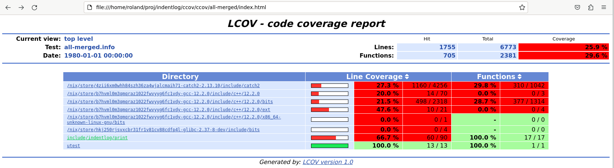

# indentlog build details

## Test Coverage

### enable coverage build
```
$ cd indentlog
$ mkdir ccov
$ cd ccov
$ cmake -DCODE_COVERAGE=ON ..      # prepares coverage build
```

### build + generate test coverage
```
$ make ccov                                               # builds + runs unit tests
$ make ccov-all                                         # generates .html report
```

### view coverage report
```
$ firefox
[navigate to coverage report;  path something like file://home/roland/proj/indentlog/ccov/ccov/all-merged/index.html]
```



## Implementation Notes

- coverage builds creates `.gcno` files alongside `.o` object files
- running coverage-enabled executables creates/appends to `.gcda` files
- e.g. see `ccov/utest/CMakeFiles/utest.indentlog.dir`
- coverage feature enabled globally in top-level `CMakeLists.txt` by:
```
include(cmake/code-coverage.cmake)
add_code_coverage()
add_code_coverage_all_targets()
```
- looks like these need to appear before executable targets are introduced
- also need to opt-in individual executables,  e.g. in `utest/CMakeLists.txt`:
```
target_code_coverage(${SELF_EXECUTABLE_NAME} AUTO ALL)
```
- here `AUTO` opts in to the `ccov` target;  `ALL` opts in to the `ccov-all` target
