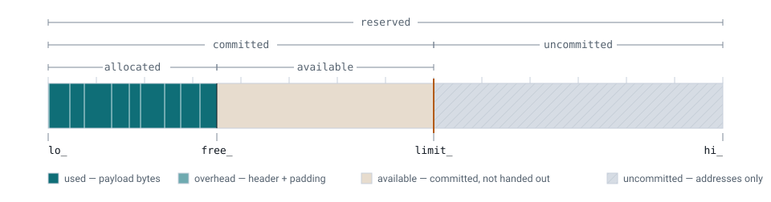

# xo-arena documentation master file

xo-arena documentation
======================

xo-arena provides:

* Fast vm-aware arena allocation.
* Allocates uncommitted virtual memory, and commits on demand.
* When available, uses THP (Transparent Huge Pages) to mitigate pagetable pressure.
* Optional GC support, with per-alloc header.

Diagnostic features:

* with alloc headers: forward iterators over individual allocations
* configurable guard memory between allocations.

          uncommitted regions between lo_ and hi_
    :align: center
    :width: 100%
    :target: lifecycle.html

    An arena after some allocations.  Objects fill it from ``lo_`` up to ``free_``;
    physical memory reaches ``limit_``, always a whole number of superpages; the rest is
    address space and nothing more.  See :doc:`lifecycle` to watch it move.

.. toctree::
    :maxdepth: 2
    :caption: xo-arena contents

    examples
    lifecycle
    implementation
    ArenaConfig-reference
    DArena-reference
    DArenaIterator-reference
    AllocInfo-reference
    cmpresult-reference
    glossary
    genindex
    search
